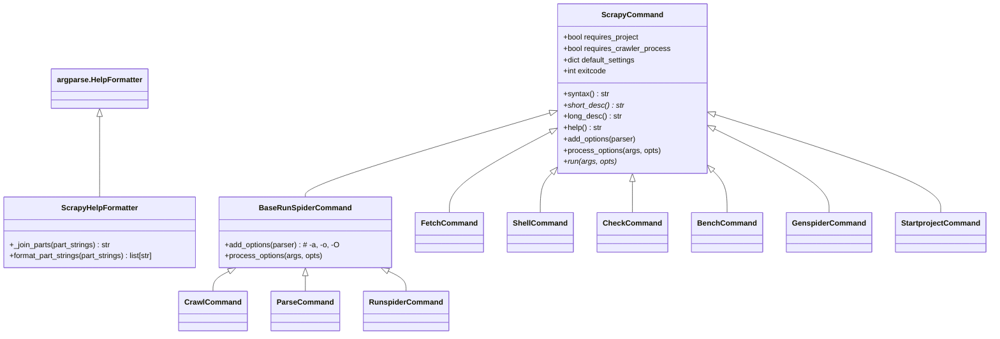
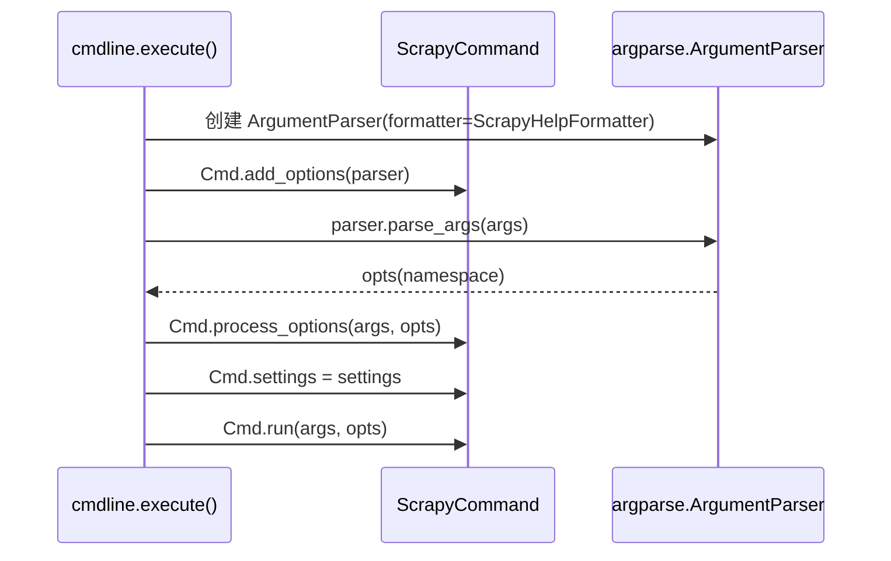

# `scrapy/commands/__init__.py`

⬜ **待分析**

---

## 📁 文件信息

| 项目 | 内容 |
|------|------|
| **文件路径** | `scrapy/commands/__init__.py` |
| **模块用途** | 所有 Scrapy 命令的基类，定义命令接口和公共选项 |
| **核心类** | `ScrapyCommand`（抽象基类）、`BaseRunSpiderCommand`（爬虫命令共享基类）、`ScrapyHelpFormatter`（自定义帮助格式） |
| **依赖关键模块** | `argparse`, `twisted.python.failure`, `pathlib.Path` |
| **行数** | 237 |

---

## 📥 导入区（L1–L24）

```python
 1: """
 2: Base class for Scrapy commands
 3: """
 4: 
 5: from __future__ import annotations
 6: 
 7: import argparse
 8: import builtins
 9: import os
10: import warnings
11: from abc import ABC, abstractmethod
12: from pathlib import Path
13: from typing import TYPE_CHECKING, Any, ClassVar
14: 
15: from twisted.python import failure
16: 
17: from scrapy.exceptions import ScrapyDeprecationWarning, UsageError
18: from scrapy.utils.conf import arglist_to_dict, feed_process_params_from_cli
19: 
20: if TYPE_CHECKING:
21:     from collections.abc import Iterable
22: 
23:     from scrapy.crawler import Crawler, CrawlerProcessBase
24:     from scrapy.settings import Settings
```

| 行号 | 标识符 | 说明 |
|------|--------|------|
| 1–3 | 模块 docstring | "Base class for Scrapy commands" |
| 5 | `from __future__ import annotations` | 启用 PEP 604，注解延迟求值 |
| 7 | `argparse` | 命令行参数解析器 |
| 8 | `builtins` | 因 `commands/list.py` 遮蔽 `list`，需用 `builtins.list()` |
| 9 | `os` | `os.getpid()` + `os.linesep` 用于 PID 文件写入 |
| 10 | `warnings` | 弃用警告（`set_crawler()`） |
| 11 | `ABC, abstractmethod` | 抽象基类支持 |
| 12 | `Path` | `Path(opts.pidfile).write_text()` |
| 13 | `TYPE_CHECKING, Any, ClassVar` | 类型注解 |
| 15 | `failure` | `failure.startDebugMode()` 用于 `--pdb` 选项 |
| 17 | `ScrapyDeprecationWarning, UsageError` | 弃用警告 + CLI 错误异常 |
| 18 | `arglist_to_dict, feed_process_params_from_cli` | `-s NAME=VALUE` 解析、`-o/-O` 输出参数处理 |
| 20–24 | `TYPE_CHECKING` 块 | 仅在静态类型检查时导入 |

---

## 类：ScrapyCommand（L26–L137）

抽象基类，所有命令的公共接口。

### 骨架（先览）

```python
 26: class ScrapyCommand(ABC):
 27:     requires_project: bool = False
 28:     requires_crawler_process: bool = True
 29:     crawler_process: CrawlerProcessBase | None = None
 30: 
 31:     default_settings: ClassVar[dict[str, Any]] = {}
 32: 
 33:     exitcode: int = 0
 34: 
 35:     def __init__(self) -> None:
 36:         self.settings: Settings | None = None
 37: 
 38:     def set_crawler(self, crawler: Crawler) -> None:
 45:     def syntax(self) -> str:
 50:     @abstractmethod
 51:     def short_desc(self) -> str:
 56:     def long_desc(self) -> str:
 61:     def help(self) -> str:
 68:     def add_options(self, parser: argparse.ArgumentParser) -> None:
 97:     def process_options(self, args, opts) -> None:
129:     @abstractmethod
130:     def run(self, args, opts) -> None:
```

- 6 个类属性 + 7 个方法，定义命令生命周期
- `requires_project` / `requires_crawler_process` 控制初始化行为
- `add_options()` → `process_options()` → `run()` 的执行顺序由 `cmdline.py` 保证

### 详细分析

```python
 26: class ScrapyCommand(ABC):
 27:     requires_project: bool = False
 28:     requires_crawler_process: bool = True
 29:     crawler_process: CrawlerProcessBase | None = None  # set in scrapy.cmdline
 30: 
 31:     # default settings to be used for this command instead of global defaults
 32:     default_settings: ClassVar[dict[str, Any]] = {}
 33: 
 34:     exitcode: int = 0
 35: 
 36:     def __init__(self) -> None:
 37:         self.settings: Settings | None = None  # set in scrapy.cmdline
```

| 行号 | 说明 |
|------|------|
| 26 | 继承 `ABC`，声明为抽象基类 |
| 27 | `requires_project = False`——默认不需要项目环境 |
| 28 | `requires_crawler_process = True`——默认需要 CrawlerProcess |
| 29 | `crawler_process = None`——在 `cmdline.py` 的 `execute()` 中设置 |
| 32 | `default_settings: ClassVar = {}`——命令级默认设置，`ClassVar` 标注为类变量 |
| 34 | `exitcode = 0`——退出码，`run()` 中可设置非零值 |
| 36–37 | `__init__()`——初始化 `settings = None`（在 `cmdline.py` 中设置） |

```python
 38:     def set_crawler(self, crawler: Crawler) -> None:  # pragma: no cover
 39:         warnings.warn(
 40:             "ScrapyCommand.set_crawler() is deprecated",
 41:             ScrapyDeprecationWarning,
 42:             stacklevel=2,
 43:         )
 44:         if hasattr(self, "_crawler"):
 45:             raise RuntimeError("crawler already set")
 46:         self._crawler: Crawler = crawler
```

| 行号 | 说明 |
|------|------|
| 38 | `set_crawler()`——已弃用，`# pragma: no cover` 排除测试覆盖率统计 |
| 39–43 | 发出 `ScrapyDeprecationWarning` |
| 44–45 | 防重入检查——若 `_crawler` 已设置则抛异常 |
| 46 | 设置 `_crawler` |

```python
 48:     def syntax(self) -> str:
 49:         """
 50:         Command syntax (preferably one-line). Do not include command name.
 51:         """
 52:         return ""
 53: 
 54:     @abstractmethod
 55:     def short_desc(self) -> str:
 56:         """
 57:         A short description of the command
 58:         """
 59:         return ""
 60: 
 61:     def long_desc(self) -> str:
 62:         """A long description of the command. Return short description when not
 63:         available. It cannot contain newlines since contents will be formatted
 64:         by optparser which removes newlines and wraps text.
 65:         """
 66:         return self.short_desc()
 67: 
 68:     def help(self) -> str:
 69:         """An extensive help for the command. It will be shown when using the
 70:         "help" command. It can contain newlines since no post-formatting will
 71:         be applied to its contents.
 72:         """
 73:         return self.long_desc()
```

| 行号 | 说明 |
|------|------|
| 48–52 | `syntax()`——命令用法字符串（一行，不含命令名本身） |
| 54–59 | `short_desc()`——**抽象方法**，子类必须实现 |
| 61–66 | `long_desc()`——详细描述，**不可含换行**（optparser 会重新格式化） |
| 68–73 | `help()`——扩展帮助，**可含换行**（`help` 命令不经 optparser 格式化） |

```python
 75:     def add_options(self, parser: argparse.ArgumentParser) -> None:
 76:         """
 77:         Populate option parse with options available for this command
 78:         """
 79:         assert self.settings is not None
 80:         group = parser.add_argument_group(title="Global Options")
 81:         group.add_argument(
 82:             "--logfile", metavar="FILE",
 83:             help="log file. if omitted stderr will be used"
 84:         )
 85:         group.add_argument(
 86:             "-L", "--loglevel", metavar="LEVEL", default=None,
 87:             help=f"log level (default: {self.settings['LOG_LEVEL']})",
 88:         )
 89:         group.add_argument(
 90:             "--nolog", action="store_true",
 91:             help="disable logging completely"
 92:         )
 93:         group.add_argument(
 94:             "--profile", metavar="FILE", default=None,
 95:             help="write python cProfile stats to FILE",
 96:         )
 97:         group.add_argument(
 98:             "--pidfile", metavar="FILE",
 99:             help="write process ID to FILE"
100:         )
101:         group.add_argument(
102:             "-s", "--set", action="append", default=[],
103:             metavar="NAME=VALUE",
104:             help="set/override setting (may be repeated)",
105:         )
106:         group.add_argument(
107:             "--pdb", action="store_true",
108:             help="enable pdb on failure"
109:         )
```

| 行号 | 选项 | 说明 |
|------|------|------|
| 79 | `assert self.settings` | 断言 settings 已初始化 |
| 80 | `add_argument_group("Global Options")` | 所有命令共享的全局选项分组 |
| 81–84 | `--logfile FILE` | 日志输出文件 |
| 85–88 | `-L/--loglevel LEVEL` | 日志级别（默认值从 `settings['LOG_LEVEL']` 动态读取） |
| 89–92 | `--nolog` | 完全禁用日志 |
| 93–96 | `--profile FILE` | 输出 cProfile 性能分析 |
| 97–100 | `--pidfile FILE` | 写入进程 PID 到文件 |
| 101–105 | `-s/--set NAME=VALUE` | 覆盖设置（可重复使用多次） |
| 106–109 | `--pdb` | 异常时自动进入 pdb 调试器 |

```python
111:     def process_options(self, args: list[str], opts: argparse.Namespace) -> None:
112:         assert self.settings is not None
113:         try:
114:             self.settings.setdict(
115:                 arglist_to_dict(opts.set), priority="cmdline"
116:             )
117:         except ValueError:
118:             raise UsageError(
119:                 "Invalid -s value, use -s NAME=VALUE", print_help=False
120:             ) from None
121: 
122:         if opts.logfile:
123:             self.settings.set("LOG_ENABLED", True, priority="cmdline")
124:             self.settings.set("LOG_FILE", opts.logfile, priority="cmdline")
125: 
126:         if opts.loglevel:
127:             self.settings.set("LOG_ENABLED", True, priority="cmdline")
128:             self.settings.set("LOG_LEVEL", opts.loglevel, priority="cmdline")
129: 
130:         if opts.nolog:
131:             self.settings.set("LOG_ENABLED", False, priority="cmdline")
132: 
133:         if opts.pidfile:
134:             Path(opts.pidfile).write_text(
135:                 str(os.getpid()) + os.linesep, encoding="utf-8"
136:             )
137: 
138:         if opts.pdb:
139:             failure.startDebugMode()
```

| 行号 | 说明 |
|------|------|
| 111 | `process_options()`——在 `run()` 之前被 `cmdline.py` 调用 |
| 112 | 断言 settings 已初始化 |
| 113–120 | `-s` 选项解析：`arglist_to_dict()` 将 `["NAME=VALUE", ...]` 转为字典后以 `cmdline` 优先级写入 settings |
| 122–124 | `--logfile`：启用日志 + 设置日志文件路径 |
| 126–128 | `--loglevel`：启用日志 + 设置日志级别 |
| 130–131 | `--nolog`：禁用日志 |
| 133–136 | `--pidfile`：将当前进程 PID 写入文件 |
| 138–139 | `--pdb`：启用 Twisted 的 failure 调试模式（异常时自动进入 pdb） |

```python
141:     @abstractmethod
142:     def run(self, args: list[str], opts: argparse.Namespace) -> None:
143:         """
144:         Entry point for running commands
145:         """
146:         raise NotImplementedError
```

| 行号 | 说明 |
|------|------|
| 141–146 | `run()`——**抽象方法**，所有命令子类必须实现的核心入口 |

---

## 类：BaseRunSpiderCommand（L140–L205）

`crawl`、`parse`、`runspider` 三个命令的共享基类，提供 `-a`、`-o`、`-O` 选项。

### 骨架（先览）

```python
140: class BaseRunSpiderCommand(ScrapyCommand):
141:     """
142:     Common class used to share functionality between the crawl, parse and runspider commands
143:     """
144: 
145:     def add_options(self, parser: argparse.ArgumentParser) -> None:
161:     def process_options(self, args: list[str], opts: argparse.Namespace) -> None:
```

- 继承 `ScrapyCommand`
- 覆盖 `add_options()` 添加 `-a`、`-o`、`-O` 参数
- 覆盖 `process_options()` 解析 spider 参数和 Feed 输出

### 详细分析

```python
140: class BaseRunSpiderCommand(ScrapyCommand):
141:     """
142:     Common class used to share functionality between the crawl, parse and runspider commands
143:     """
144: 
145:     def add_options(self, parser: argparse.ArgumentParser) -> None:
146:         super().add_options(parser)
147:         parser.add_argument(
148:             "-a",
149:             dest="spargs",
150:             action="append",
151:             default=[],
152:             metavar="NAME=VALUE",
153:             help="set spider argument (may be repeated)",
154:         )
155:         parser.add_argument(
156:             "-o", "--output", metavar="FILE", action="append",
157:             help="append scraped items to the end of FILE (use - for stdout),"
158:             " to define format set a colon at the end of the output URI"
159:             " (i.e. -o FILE:FORMAT)",
160:         )
161:         parser.add_argument(
162:             "-O", "--overwrite-output", metavar="FILE", action="append",
163:             help="dump scraped items into FILE, overwriting any existing file,"
164:             " to define format set a colon at the end of the output URI"
165:             " (i.e. -O FILE:FORMAT)",
166:         )
```

| 行号 | 选项 | 说明 |
|------|------|------|
| 146 | `super().add_options(parser)` | 先添加全局选项 |
| 147–154 | `-a NAME=VALUE` | spider 参数（可重复），传给 spider 的 `__init__()` |
| 155–160 | `-o/--output FILE` | 追加输出，支持 `FILE:FORMAT` 格式 |
| 161–166 | `-O/--overwrite-output FILE` | 覆盖输出，支持 `FILE:FORMAT` 格式 |

```python
168:     def process_options(self, args: list[str], opts: argparse.Namespace) -> None:
169:         super().process_options(args, opts)
170:         try:
171:             opts.spargs = arglist_to_dict(opts.spargs)
172:         except ValueError:
173:             raise UsageError(
174:                 "Invalid -a value, use -a NAME=VALUE", print_help=False
175:             ) from None
176:         if opts.output or opts.overwrite_output:
177:             assert self.settings is not None
178:             feeds = feed_process_params_from_cli(
179:                 self.settings,
180:                 opts.output,
181:                 overwrite_output=opts.overwrite_output,
182:             )
183:             self.settings.set("FEEDS", feeds, priority="cmdline")
```

| 行号 | 说明 |
|------|------|
| 169 | 先调用父类 `process_options()` 处理全局选项 |
| 170–175 | `-a` 选项解析：`["count=5", "depth=3"]` → `{"count": "5", "depth": "3"}` |
| 176 | 若有 `-o` 或 `-O` 选项 |
| 177–183 | 调用 `feed_process_params_from_cli()` 将 CLI 参数转为 `FEEDS` 设置的 dict 格式，以 `cmdline` 优先级写入 |

---

## 类：ScrapyHelpFormatter（L208–L237）

类较小，直接贴完整代码并分析。

```python
208: class ScrapyHelpFormatter(argparse.HelpFormatter):
209:     """
210:     Help Formatter for scrapy command line help messages.
211:     """
212: 
213:     def __init__(
214:         self,
215:         prog: str,
216:         indent_increment: int = 2,
217:         max_help_position: int = 24,
218:         width: int | None = None,
219:     ):
220:         super().__init__(
221:             prog,
222:             indent_increment=indent_increment,
223:             max_help_position=max_help_position,
224:             width=width,
225:         )
226: 
227:     def _join_parts(self, part_strings: Iterable[str]) -> str:
228:         # scrapy.commands.list shadows builtins.list
229:         parts = self.format_part_strings(builtins.list(part_strings))
230:         return super()._join_parts(parts)
231: 
232:     def format_part_strings(self, part_strings: list[str]) -> list[str]:
233:         """
234:         Underline and title case command line help message headers.
235:         """
236:         if part_strings and part_strings[0].startswith("usage: "):
237:             part_strings[0] = "Usage\n=====\n  " + part_strings[0][len("usage: ") :]
238:         headings = [
239:             i for i in range(len(part_strings))
240:             if part_strings[i].endswith(":\n")
241:         ]
242:         for index in reversed(headings):
243:             char = "-" if "Global Options" in part_strings[index] else "="
244:             part_strings[index] = part_strings[index][:-2].title()
245:             underline = "".join(["\n", (char * len(part_strings[index])), "\n"])
246:             part_strings.insert(index + 1, underline)
247:         return part_strings
```

| 行号 | 说明 |
|------|------|
| 208 | 继承 `argparse.HelpFormatter`，自定义帮助信息格式 |
| 213–225 | `__init__()`——透传所有参数给父类，使用更宽的 `max_help_position=24` |
| 227–230 | `_join_parts()`——先调用 `format_part_strings()` 格式化后再拼接。**`builtins.list`** 避免 `commands.list` 模块遮蔽 `list` |
| 232–247 | `format_part_strings()`——核心格式化逻辑 |
| 236–237 | 将 `"usage: scrapy crawl [options] <spider>"` 替换为 `"Usage\n=====\n  scrapy crawl ..."` |
| 238–241 | 查找以 `:\n` 结尾的标题行（如 `optional arguments:`） |
| 242–246 | **逆序遍历**标题行，为其添加下划线：全局选项用 `-`（装饰性），其他用 `=`（分隔性） |

---

## 🔄 继承关系图（Mermaid 类图）



## 🔄 执行流程（Mermaid 时序图）



---

## ⚠️ 关键点与陷阱

### 关键点

1. **`requires_project` 和 `requires_crawler_process`**（L27-28）
   - 两个标志控制 `cmdline.py` 是否初始化 CrawlerProcess。`requires_project=True` 的命令只能在 Scrapy 项目目录中执行。

2. **`default_settings` 是类变量**（L32）
   - 用 `ClassVar` 声明，子类可覆盖。优先级在项目设置之上、`-s` 选项之下。

3. **`builtins.list`**（L229）
   - `commands/list.py` 将 `list` 名称遮蔽，必须用 `builtins.list()` 避免 `NameError`。

4. **`process_options()` 在 `run()` 之前调用**
   - 由 `cmdline.py` 保证调用顺序，确保 `run()` 执行时所有设置已就位。

5. **`help()` 方法不限制换行**（L68-73）
   - 与 `long_desc()` 不同，`help()` 内容不经 optparser 格式化，可包含换行用于 `help` 命令输出。

### 陷阱

1. **`# pragma: no cover` 在 `set_crawler()` 上**（L38）
   - 已弃用的方法被标注排除在测试覆盖率统计之外，不应在新代码中使用。

2. **`opts.set` 默认 `[]` 但 `action="append"`**
   - 未提供 `-s` 时 `opts.set` 为空列表，`arglist_to_dict([])` 返回空字典，不会报错。

3. **`UsageError` 的 `print_help=False`**（L119）
   - 在 `process_options()` 中抛出错误时，明确指示不打印帮助信息，避免信息冗余。

4. **`"usage: "` 字符串长度恰好 7 个字符**
   - argparse 固定前缀，`len("usage: ")` 不是笔误，第 237 行的切片 `[7:]` 去掉前缀。
