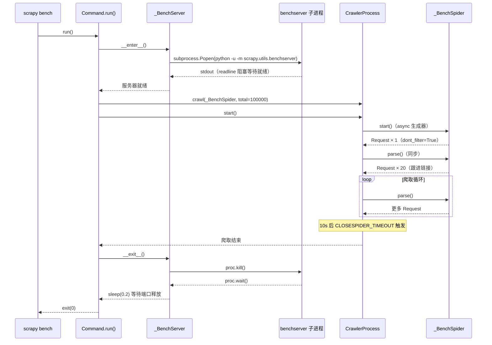

# `scrapy/commands/bench.py`

⬜ **待分析**

---

## 📁 文件信息

| 项目 | 内容 |
|------|------|
| **文件路径** | `scrapy/commands/bench.py` |
| **模块用途** | `scrapy bench` 命令的实现——运行快速基准测试 |
| **核心类** | `Command`（命令入口）、`_BenchServer`（测试 HTTP 服务器）、`_BenchSpider`（测试爬虫） |
| **依赖关键模块** | `subprocess`, `scrapy.utils.benchserver`, `scrapy.linkextractors.LinkExtractor` |
| **行数** | 69 |

---

## 📥 导入区（L1–L17）

```python
 1: from __future__ import annotations
 2: 
 3: import subprocess
 4: import sys
 5: import time
 6: from typing import TYPE_CHECKING, Any, ClassVar
 7: from urllib.parse import urlencode
 8: 
 9: import scrapy
10: from scrapy.commands import ScrapyCommand
11: from scrapy.http import Response, TextResponse
12: from scrapy.linkextractors import LinkExtractor
13: from scrapy.utils.test import get_testenv
14: 
15: if TYPE_CHECKING:
16:     import argparse
17:     from collections.abc import AsyncIterator
```

| 行号 | 标识符 | 说明 |
|------|--------|------|
| 1 | `from __future__ import annotations` | 启用 PEP 604，注解延迟求值 |
| 3 | `subprocess` | 启动独立子进程运行基准 HTTP 服务器 |
| 4 | `sys` | `sys.executable` 获取当前 Python 解释器路径 |
| 5 | `time` | `time.sleep(0.2)` 等待子进程退出释放端口 |
| 6 | `TYPE_CHECKING, Any, ClassVar` | 类型注解 |
| 7 | `urlencode` | 构建带 `total` 和 `show` 参数的查询 URL |
| 9 | `scrapy` | 模块级 import——`_BenchSpider` 中用 `scrapy.Spider` 和 `scrapy.Request` |
| 10 | `ScrapyCommand` | 命令基类 |
| 11 | `Response, TextResponse` | 类型注解用 |
| 12 | `LinkExtractor` | 链接提取器，提取所有 `<a>` 标签 |
| 13 | `get_testenv` | 注入含 Scrapy 源码路径的环境变量到子进程 |
| 15–17 | `TYPE_CHECKING` 块 | 仅在静态类型检查时导入 |

---

## 类：Command（L19–L37）

类较小，直接贴完整代码并分析。

```python
19: class Command(ScrapyCommand):
20:     default_settings: ClassVar[dict[str, Any]] = {
21:         "LOG_LEVEL": "INFO",
22:         "LOGSTATS_INTERVAL": 1,
23:         "CLOSESPIDER_TIMEOUT": 10,
24:     }
25: 
26:     def short_desc(self) -> str:
27:         return "Run quick benchmark test"
28: 
29:     def run(self, args: list[str], opts: argparse.Namespace) -> None:
30:         with _BenchServer():
31:             assert self.crawler_process
32:             self.crawler_process.crawl(_BenchSpider, total=100000)
33:             self.crawler_process.start()
```

| 行号 | 说明 |
|------|------|
| 19 | 继承 `ScrapyCommand` |
| 20–24 | `default_settings`——覆盖三个设置：`LOG_LEVEL=INFO`（默认 DEBUG 减少日志噪音）、`LOGSTATS_INTERVAL=1`（每秒输出统计）、`CLOSESPIDER_TIMEOUT=10`（10 秒自动停止） |
| 26–27 | `short_desc()`——"Run quick benchmark test" |
| 29 | `run()`——命令执行入口 |
| 30 | **`with _BenchServer():`**——上下文管理器确保基准服务器在爬取前后正确启动/关闭 |
| 31 | `assert self.crawler_process`——断言 `cmdline.py` 已设置 |
| 32 | **`.crawl(_BenchSpider, total=100000)`**——注册 spider，覆盖默认 `total=10000` 为 `100000` |
| 33 | **`.start()`**——阻塞调用，直到爬取完成或 `CLOSESPIDER_TIMEOUT` 触发 |

---

## 类：_BenchServer（L39–L56）

类较小，直接贴完整代码并分析。

```python
39: class _BenchServer:
40:     def __enter__(self) -> None:
41:         pargs = [sys.executable, "-u", "-m", "scrapy.utils.benchserver"]
42:         self.proc = subprocess.Popen(  # noqa: S603
43:             pargs, stdout=subprocess.PIPE, env=get_testenv()
44:         )
45:         assert self.proc.stdout
46:         self.proc.stdout.readline()
47: 
48:     def __exit__(self, exc_type, exc_value, traceback) -> None:  # type: ignore[no-untyped-def]
49:         self.proc.kill()
50:         self.proc.wait()
51:         time.sleep(0.2)
```

| 行号 | 说明 |
|------|------|
| 39 | `class _BenchServer:`——上下文管理器（无 `__init__`） |
| 40–46 | `__enter__()`——启动基准 HTTP 服务器子进程 |
| 41 | `pargs = [sys.executable, "-u", "-m", "scrapy.utils.benchserver]`——`-u` 无缓冲（stdout 及时输出），`-m` 以模块方式运行 |
| 42–44 | **`subprocess.Popen(pargs, stdout=PIPE, env=get_testenv())`**——`stdout=PIPE` 捕获输出，`env=get_testenv()` 注入 PYTHONPATH |
| 45–46 | **阻塞等待服务器就绪**——`readline()` 等待子进程输出一行表示端口监听就绪后才返回 |
| 48–51 | `__exit__()`——关闭服务器 |
| 49 | **`self.proc.kill()`**——强制终止（SIGKILL），非优雅关闭 |
| 50 | `self.proc.wait()`——等待进程完全退出，防止僵尸进程 |
| 51 | `time.sleep(0.2)`——等待操作系统释放端口 |

---

## 类：_BenchSpider（L58–L75）

类较小，直接贴完整代码并分析。

```python
58: class _BenchSpider(scrapy.Spider):
59:     """A spider that follows all links"""
60: 
61:     name = "follow"
62:     total = 10000
63:     show = 20
64:     baseurl = "http://localhost:8998"
65:     link_extractor = LinkExtractor()
66: 
67:     async def start(self) -> AsyncIterator[Any]:
68:         qargs = {"total": self.total, "show": self.show}
69:         url = f"{self.baseurl}?{urlencode(qargs, doseq=True)}"
70:         yield scrapy.Request(url, dont_filter=True)
71: 
72:     def parse(self, response: Response) -> Any:
73:         assert isinstance(response, TextResponse)
74:         for link in self.link_extractor.extract_links(response):
75:             yield scrapy.Request(link.url, callback=self.parse)
```

| 行号 | 说明 |
|------|------|
| 58 | 继承 `scrapy.Spider` |
| 59 | docstring："A spider that follows all links" |
| 61 | `name = "follow"`——spider 名称 |
| 62 | `total = 10000`——默认总页面数（被 `Command.run()` 中的 `total=100000` 覆盖） |
| 63 | `show = 20`——每页显示 20 条链接 |
| 64 | `baseurl = "http://localhost:8998"`——基准服务器地址 |
| 65 | `link_extractor = LinkExtractor()`——默认链接提取器 |
| 67–70 | **`async def start()`**——异步生成器，产出一个初始请求 |
| 68 | 构造查询参数，告诉服务器返回多少页面 |
| 69 | `urlencode(qargs, doseq=True)`——`doseq=True` 将列表参数正确编码 |
| 70 | **`yield scrapy.Request(url, dont_filter=True)`**——`dont_filter=True` 跳过去重 |
| 72–75 | **`def parse()`（同步方法）**——递归跟进所有链接 |
| 73 | `assert isinstance(response, TextResponse)`——类型窄化（供类型检查器） |
| 74–75 | 提取链接并 yield 新的 Request，形成爬取循环 |

---

## 🔄 执行流程（Mermaid 时序图）



---

## ⚠️ 关键点与陷阱

### 关键点

1. **子进程隔离的 HTTP 服务器**
   - `_BenchServer` 在独立子进程中运行，因为 Twisted reactor 不能同时作为 HTTP 服务端和 Scrapy 爬虫客户端。

2. **`get_testenv()` 注入 PYTHONPATH**
   - 确保子进程中能正确导入 `scrapy.utils.benchserver`，在开发环境下也能正常工作。

3. **`CLOSESPIDER_TIMEOUT=10` 自动停止**
   - 由 `CloseSpider` 扩展在引擎层实现，10 秒后自动关闭，保证测试不会无限运行。

4. **async + 同步混用**
   - `start()` 是 `async def`（异步生成器），`parse()` 是普通 `def`。Scrapy 的 `ensure_awaitable()` 统一处理两种类型。

5. **`dont_filter=True`**
   - 基准测试中不需要 URL 去重，每个请求都应当被下载。

### 陷阱

1. **`readline()` 同步阻塞死锁风险**
   - `__enter__()` 中的 `self.proc.stdout.readline()` 是同步阻塞调用。如果子进程意外无输出（如启动失败），会永久死锁。

2. **`time.sleep(0.2)` 端口释放窗口**
   - `__exit__()` 中的 0.2 秒等待是硬编码值，在系统负载高时可能不足以让端口完全释放，快速连续运行可能导致端口冲突。

3. **`# noqa: S603`——subprocess 安全检查忽略**
   - bandit 对 `subprocess.Popen` 报警，此处参数来自 `sys.executable`（非用户输入），可安全忽略。

4. **`# type: ignore[no-untyped-def]`**
   - `__exit__()` 方法参数未标注类型，mypy 默认检查会报警，此处显式忽略。
