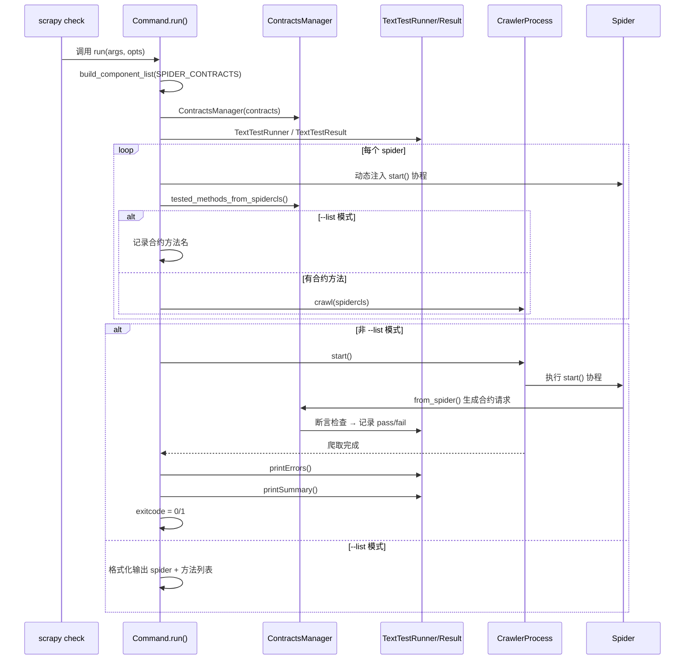

# `scrapy/commands/check.py`

⬜ **待分析**

---

## 📁 文件信息

| 项目 | 内容 |
|------|------|
| **文件路径** | `scrapy/commands/check.py` |
| **模块用途** | `scrapy check` 命令的实现——通过 contracts（合约）机制对 spider 进行自动化测试 |
| **核心类** | `TextTestResult`（测试结果格式化）、`Command`（命令入口） |
| **依赖关键模块** | `unittest.TextTestRunner`, `ContractsManager`, `build_component_list` |
| **行数** | 122 |

---

## 📥 导入区（L1–L14）

```python
 1: import argparse
 2: import time
 3: from collections import defaultdict
 4: from collections.abc import AsyncIterator
 5: from typing import Any, ClassVar
 6: from unittest import TextTestResult as _TextTestResult
 7: from unittest import TextTestRunner
 8: 
 9: from scrapy import Spider
10: from scrapy.commands import ScrapyCommand
11: from scrapy.contracts import ContractsManager
12: from scrapy.utils.conf import build_component_list
13: from scrapy.utils.misc import load_object, set_environ
```

| 行号 | 标识符 | 说明 |
|------|--------|------|
| 1 | `argparse` | 命令行参数解析 |
| 2 | `time` | 性能计时（`time.monotonic()`） |
| 3 | `defaultdict` | 以 spider 名分组存储 contract 列表 |
| 4 | `AsyncIterator` | 类型注解，用于 `start()` 协程返回类型 |
| 5 | `Any, ClassVar` | 类型注解 |
| 6 | `_TextTestResult` | 标准库 `TextTestResult` 别名，作为基类 |
| 7 | `TextTestRunner` | 标准库测试运行器 |
| 9 | `Spider` | Scrapy 爬虫基类 |
| 10 | `ScrapyCommand` | 命令基类 |
| 11 | `ContractsManager` | 合约管理器，负责加载和执行合约 |
| 12 | `build_component_list` | 从配置中按优先级构建组件列表 |
| 13 | `load_object, set_environ` | 动态加载类/函数、临时设置环境变量 |

---

## 类：TextTestResult（L16–L42）

类较小，直接贴完整代码并分析。

```python
16: class TextTestResult(_TextTestResult):
17:     def printSummary(self, start: float, stop: float) -> None:
18:         write = self.stream.write
19:         writeln = self.stream.writeln
20: 
21:         run = self.testsRun
22:         plural = "s" if run != 1 else ""
23: 
24:         writeln(self.separator2)
25:         writeln(f"Ran {run} contract{plural} in {stop - start:.3f}s")
26:         writeln()
27: 
28:         infos = []
29:         if not self.wasSuccessful():
30:             write("FAILED")
31:             failed, errored = map(len, (self.failures, self.errors))
32:             if failed:
33:                 infos.append(f"failures={failed}")
34:             if errored:
35:                 infos.append(f"errors={errored}")
36:         else:
37:             write("OK")
38: 
39:         if infos:
40:             writeln(f" ({', '.join(infos)})")
41:         else:
42:             write("\n")
```

| 行号 | 说明 |
|------|------|
| 16 | 继承 `_TextTestResult`（即 `unittest.TextTestResult`） |
| 17 | `printSummary(start, stop)`——自定义汇总输出方法 |
| 18–19 | 缓存 `self.stream.write/writeln` 引用，减少属性查找 |
| 21–22 | 计算运行用例数，处理复数形式 "contract(s)" |
| 24–26 | 输出分隔线 + 耗时统计 |
| 28–37 | 根据 `wasSuccessful()` 输出 "OK" 或 "FAILED"，并附上 failures/errors 数量 |
| 39–42 | 若有失败/错误信息则拼接输出，否则换行 |

---

## 类：Command（L44–L122）

### 骨架（先览）

```python
44: class Command(ScrapyCommand):
45:     requires_project = True
46:     default_settings: ClassVar[dict[str, Any]] = {"LOG_ENABLED": False}
47: 
48:     def syntax(self) -> str:
52:     def short_desc(self) -> str:
54:     def add_options(self, parser: argparse.ArgumentParser) -> None:
70:     def run(self, args: list[str], opts: argparse.Namespace) -> None:
```

- 继承 `ScrapyCommand`，需在项目目录下运行
- 关闭日志输出（`LOG_ENABLED: False`）
- 4 个核心方法：`syntax()`、`short_desc()`、`add_options()`、`run()`

### 详细分析

```python
44: class Command(ScrapyCommand):
45:     requires_project = True
46:     default_settings: ClassVar[dict[str, Any]] = {"LOG_ENABLED": False}
47: 
48:     def syntax(self) -> str:
49:         return "[options] <spider>"
50: 
51:     def short_desc(self) -> str:
52:         return "Check spider contracts"
53: 
54:     def add_options(self, parser: argparse.ArgumentParser) -> None:
55:         super().add_options(parser)
56:         parser.add_argument(
57:             "-l", "--list",
58:             dest="list",
59:             action="store_true",
60:             help="only list contracts, without checking them",
61:         )
62:         parser.add_argument(
63:             "-v", "--verbose",
64:             dest="verbose",
65:             default=False,
66:             action="store_true",
67:             help="print contract tests for all spiders",
68:         )
```

| 行号 | 说明 |
|------|------|
| 44–46 | 继承 `ScrapyCommand`；需项目环境；关闭日志 |
| 48–49 | 用法：`scrapy check [options] <spider>` |
| 51–52 | 命令描述：检查 spider contracts |
| 54–55 | 调用父类 `add_options`，添加通用选项 |
| 56–61 | `-l/--list`：仅列出合约，不实际执行 |
| 62–68 | `-v/--verbose`：输出所有 spider 的合约测试详情 |

```python
70:     def run(self, args: list[str], opts: argparse.Namespace) -> None:
71:         # load contracts
72:         assert self.settings is not None
73:         contracts = build_component_list(
74:             self.settings.get_component_priority_dict_with_base("SPIDER_CONTRACTS")
75:         )
76:         conman = ContractsManager(load_object(c) for c in contracts)
77:         runner = TextTestRunner(verbosity=2 if opts.verbose else 1)
78:         result = TextTestResult(runner.stream, runner.descriptions, runner.verbosity)
79: 
80:         # contract requests
81:         contract_reqs = defaultdict(list)
82: 
83:         assert self.crawler_process
84:         spider_loader = self.crawler_process.spider_loader
85: 
86:         async def start(self: Spider) -> AsyncIterator[Any]:
87:             for request in conman.from_spider(self, result):
88:                 yield request
89: 
90:         with set_environ(SCRAPY_CHECK="true"):
91:             for spidername in args or spider_loader.list():
92:                 spidercls = spider_loader.load(spidername)
93:                 spidercls.start = start
94: 
95:                 tested_methods = conman.tested_methods_from_spidercls(spidercls)
96:                 if opts.list:
97:                     for method in tested_methods:
98:                         contract_reqs[spidercls.name].append(method)
99:                 elif tested_methods:
100:                     self.crawler_process.crawl(spidercls)
101: 
102:             # start checks
103:             if opts.list:
104:                 print(
105:                     "\n".join(
106:                         f"{spider}\n"
107:                         + "\n".join(f"  * {method}" for method in sorted(methods))
108:                         for spider, methods in sorted(contract_reqs.items())
109:                         if methods or opts.verbose
110:                     )
111:                 )
112:             else:
113:                 start_time = time.monotonic()
114:                 self.crawler_process.start()
115:                 stop = time.monotonic()
116: 
117:                 result.printErrors()
118:                 result.printSummary(start_time, stop)
119:                 self.exitcode = int(not result.wasSuccessful())
```

| 行号 | 说明 |
|------|------|
| 70 | `run()` 方法——命令执行入口 |
| 72 | 断言 settings 已初始化 |
| 73–75 | 从 `SPIDER_CONTRACTS` 设置中按优先级构建合约组件列表 |
| 76 | 创建 `ContractsManager` 实例，动态加载合约类 |
| 77–78 | 创建 `TextTestRunner` 和 `TextTestResult` 实例 |
| 81 | `contract_reqs`：defaultdict(list)，用于 `--list` 模式 |
| 83–84 | 获取 spider_loader |
| 86–88 | **动态定义 `start()` 协程**——遍历 `conman.from_spider()` 生成的合约请求并 yield |
| 90 | **`set_environ(SCRAPY_CHECK="true")`**——设置环境变量标记当前处于 check 模式 |
| 91 | 遍历命令行指定的 spider 名，或全部 spider |
| 92–93 | 加载 spider 类，**动态注入 `start()` 方法**覆盖原有方法 |
| 95 | 获取该 spider 中所有被合约测试的方法 |
| 96–98 | `--list` 模式：记录合约方法名到 `contract_reqs` |
| 99–100 | 非 list 模式且有合约方法：调用 `crawl()` 加入爬虫队列 |
| 103–111 | `--list` 模式：格式化输出 spider 及其合约方法列表 |
| 113–114 | 非 list 模式：**启动爬虫流程**，记录开始时间 |
| 117–118 | 输出错误详情 + 汇总信息（耗时、成功/失败统计） |
| 119 | 根据测试结果设置进程退出码（0=成功，1=失败） |

---

## 🔄 执行流程（Mermaid 时序图）



---

## ⚠️ 关键点与陷阱

### 关键点

1. **动态注入 `start()` 方法**（L86-88，L92-93）
   - `start()` 是在 `run()` 内动态定义的协程，通过 `spidercls.start = start` 注入到 spider 类
   - 这使得 `ContractsManager.from_spider()` 生成的合约请求成为 spider 的起始请求

2. **`set_environ(SCRAPY_CHECK="true")`**（L90）
   - 设置环境变量标记当前处于 check 模式，spider 内部可通过 `os.environ.get("SCRAPY_CHECK")` 感知
   - 退出 with 块后自动恢复原环境变量

3. **`build_component_list` 加载合约**（L73-75）
   - 从 `SPIDER_CONTRACTS` 配置中按优先级排序，用于加载自定义合约组件

4. **退出码设置**（L119）
   - `self.exitcode = int(not result.wasSuccessful())` —— 0 表示全部通过，1 表示有失败

### 陷阱

1. **`start()` 方法不可复用**
   - `start` 是函数内部定义的协程（非绑定方法），通过 `spidercls.start = start` 赋值给类属性
   - 这不影响其他 spider 类，因为每个迭代中重新加载 spider 类

2. **`--list` 模式不启动爬虫**
   - 在 `--list` 模式下 `crawler_process.start()` 不会执行，只输出合约方法列表
   - `contract_reqs` 字典在非 `--list` 模式下不会被使用

3. **`assert self.settings` 和 `assert self.crawler_process`**
   - 使用 `assert` 而非条件判断，在 `-O` 优化模式下会被跳过，可能导致 `None` 引用错误

4. **合约测试不保证顺序**
   - `conman.from_spider()` 生成的请求顺序由合约实现决定，测试输出顺序可能不确定
